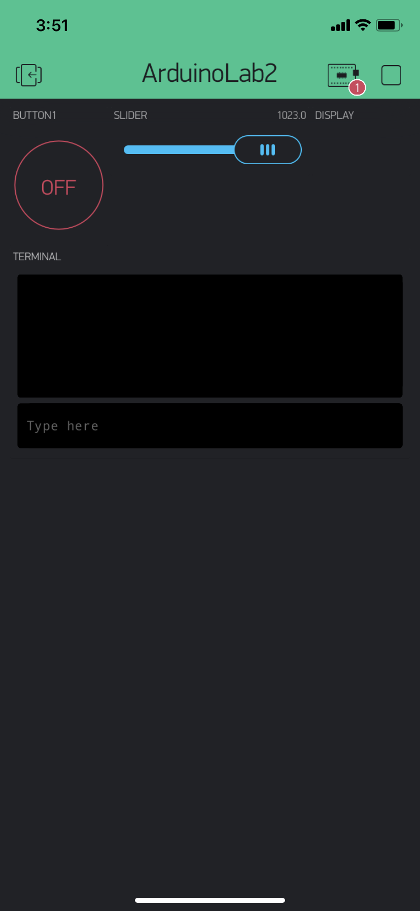

Name: Jonathan Hamada

EID: jth3238

Team Number: F7

## Questions

1. What is the purpose of an IP address?

    To identify the computers in a network.

2. What is a DNS? What are the benefits of using domain names instead of IP addresses?

    DNS is like an IP address but because IP addresses can be hard to remember since they are literally numbers, DNS is easier because it is a name.

3. What is the difference between a static IP and a dynamic IP?

    A static IP is constant and does not change while a dynamic IP will change over time.

4. What is the tradeoff between UDP and TCP protocols?

    Though TCP protocols are reliable and accurate in sending information, UDP is a lot faster.

5. Why can't we use the delay function with Blynk?

    A delay cannot be used because it would stop up the program on a wait while it can be doing other functions.

6. What does it mean for a function to be "Blocking"?

    Blocking means whenever an operation is occuring, it cannot be stopped and the other functions must wait for the first to finish before they can start.

7. Why are interrupts useful for writing Non-Blocking code?

    Interrupts are useful for Non-Blocking code especially for I/O since it allows a function to be stopped or skipped for a higher priority function.

8. What is the difference between interface and implementation? Why is it important?

   An interface is like the basic framework of methods and subroutines whereas implementation is how each method or subroutine works. They are both important because they are the building blocks of the code.

9. Screenshot of your Blynk App:

    
